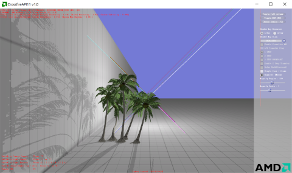

# AMD Crossfire API Sample

The CrossfireAPI11 DirectX&reg; 11 sample demonstrates how to use the explicit Crossfire API. This driver extension provides the ability to control resource transfers between GPUs in Crossfire configuration in DirectX 11. This allows improved performance in multi-GPU configurations.

The CrossfireAPI11 sample shows how the Crossfire API is used in the context of shadow caching. The sample shows:
* How to use different transfer modes with the Crossfire API
* How to reduce contentions using 2-step transfers
* How different shadow map layouts affect Crossfire performance
* How different shadow update schemes affect Crossfire performance

The CrossfireAPI11 sample uses the ShadowFX library. For information on ShadowFX, visit the ShadowFX repository: https://github.com/GPUOpen-Effects/ShadowFX

The Crossfire API driver extension is accessed through the AMD GPU Services (AGS) library. For more information on AGS, including samples, visit the AGS SDK repository: https://github.com/GPUOpen-LibrariesAndSDKs/AGS_SDK

The CrossfireAPI11 sample also comes with an extensive guide for multi-GPU: the *AMD Crossfire guide for Direct3D&reg; 11 applications*. It describes the Crossfire implementation in AMD drivers and documents the Crossfire API extensions. The information available in the guide is:
* How to navigate AMD Radeon Settings to control Crossfire
* How user and driver profiles work
* How the AFR-Compatible mode works
* How to make an application AFR-Friendly
* How to use the Crossfire API to control resource transfers and synchronizations between GPUs
* How to minimize memory transfers using the API
* How to minimize contention when using the API
* How to disable Crossfire programmatically
* How to force an application to execute on a discrete GPU rather than an integrated GPU

### Prerequisites
* AMD Radeon&trade; GCN-based GPU (HD 7000 series or newer)
* 64-bit Windows&reg; 7 (SP1 with the [Platform Update](https://msdn.microsoft.com/en-us/library/windows/desktop/jj863687.aspx)), Windows&reg; 8.1, or Windows&reg; 10
* Visual Studio&reg; 2012, Visual Studio&reg; 2013, or Visual Studio&reg; 2015
* Radeon Software Crimson Edition Graphics Driver, version 16.2 or later

### Getting Started
* Visual Studio solutions for VS2012, VS2013, and VS2015 can be found in the `crossfireapi11\build` directory.
* Additional documentation can be found in the `crossfireapi11\doc` directory.

### Premake
The Visual Studio solutions and projects in this repo were generated with Premake. To generate the project files yourself (for another version of Visual Studio, for example), open a command prompt in the `premake` directory and execute the following command:

* `update_vs_files_for_dx11_sample.bat crossfireapi11 [action]`
* For example: `update_vs_files_for_dx11_sample.bat crossfireapi11 vs2010`

This version of Premake has been modified from the stock version to use the property sheet technique for the Windows SDK from this [Visual C++ Team blog post](http://blogs.msdn.com/b/vcblog/archive/2012/11/23/using-the-windows-8-sdk-with-visual-studio-2010-configuring-multiple-projects.aspx). The technique was originally described for using the Windows 8.0 SDK with Visual Studio 2010, but it applies more generally to using newer versions of the Windows SDK with older versions of Visual Studio.

The default SDK for a particular version of Visual Studio (for 2012 or higher) is installed as part of Visual Studio installation. This default (Windows 8.0 SDK for Visual Studio 2012 and Windows 8.1 SDK for Visual Studio 2013) will be used if newer SDKs do not exist on the user's machine. However, the projects generated with this version of Premake will use the next higher SDK (Windows 8.1 SDK for Visual Studio 2012 and Windows 10 SDK with Visual Studio 2013), if the newer SDKs exist on the user's machine.

For Visual Studio 2015, this version of Premake adds the `WindowsTargetPlatformVersion` element to the project file to specify which version of the Windows SDK will be used. To change `WindowsTargetPlatformVersion` for Visual Studio 2015, change the value for `_AMD_WIN_SDK_VERSION` in `premake\amd_premake_util.lua` and regenerate the Visual Studio files.

### Third-Party Software
* DXUT is distributed under the terms of the MIT License. See `dxut\MIT.txt`.
* Premake is distributed under the terms of the BSD License. See `premake\LICENSE.txt`.

### Attribution
* AMD, the AMD Arrow logo, Radeon, and combinations thereof are either registered trademarks or trademarks of Advanced Micro Devices, Inc. in the United States and/or other countries.
* Microsoft, Direct3D, DirectX, Visual Studio, and Windows are either registered trademarks or trademarks of Microsoft Corporation in the United States and/or other countries.